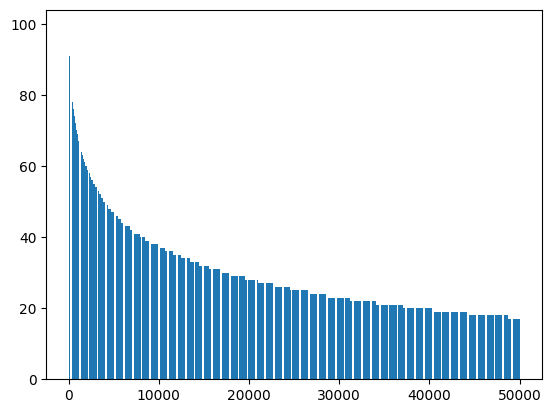
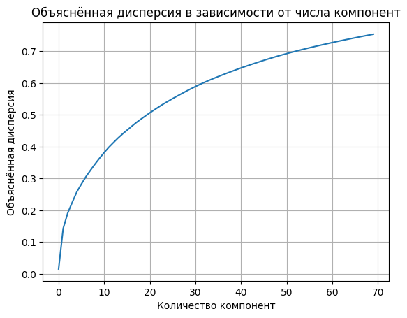

# user-item-embedding-pipeline  
> Построение shared embedding space для пользователей и товаров (Ozon Hackathon)

Команда: 3 человека.  
**Я отвечал за ядро пайплайна**:  
- обработка сырых логов (6M+ айтемов, миллионы пользователей),  
- feature engineering и анализ распределений,  
- построение **мультимодальных эмбеддингов айтемов**,  
- проектирование и обучение **two-tower модели** для отображения истории пользователя и товаров в единое пространство.

---

### Глубокий анализ и инжиниринг

#### Закон Ципфа и popularity-фичи  
Проверка гипотезы степенного распределения популярности → обоснование `z-score`, `zipf_dev`, `tailness`.  

#### Sparse → dense: TruncatedSVD  
70 компонент объясняют **>70% дисперсии** категориальных признаков — баланс между размером и информативностью.  

#### Иерархия категорий  
Poincaré embeddings (15d) на подграфе одежды, Hit@1 = **0.72** — сохранение семантической структуры каталога.

### Мультимодальные эмбеддинги айтемов
Конкатенация 4 источников:
- структурные признаки (SVD),
- popularity-сигналы (нормализованные),
- категория (Poincaré),
- визуал (fCLIP),  
+ внешние текстовые эмбеддинги (агрегированные по `item_id`).

### Two-tower модель
- **User tower**: GRU + временные фичи (`velocity`, `acceleration`, `hour sin/cos`) + success/failure-паттерны → attention masking.
- **Item tower**: 2-слойный MLP.
- **Loss**: Pairwise Logistic Ranking (positive = `delivered`, negative = `canceled` + failure items).

### Инженерия масштаба
- обработка чанками (`polars`),
- sparse → dense только в нужный момент,
- кастомный `IterableDataset` + lazy loading,
- управление памятью (`gc`, `torch.cuda.empty_cache()`),
- multi-worker `DataLoader`.

---

## Стек
`Python` `PyTorch` `Polars` `scikit-learn` `Gensim` `NetworkX` `scipy.sparse` `joblib`
